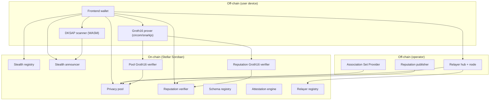
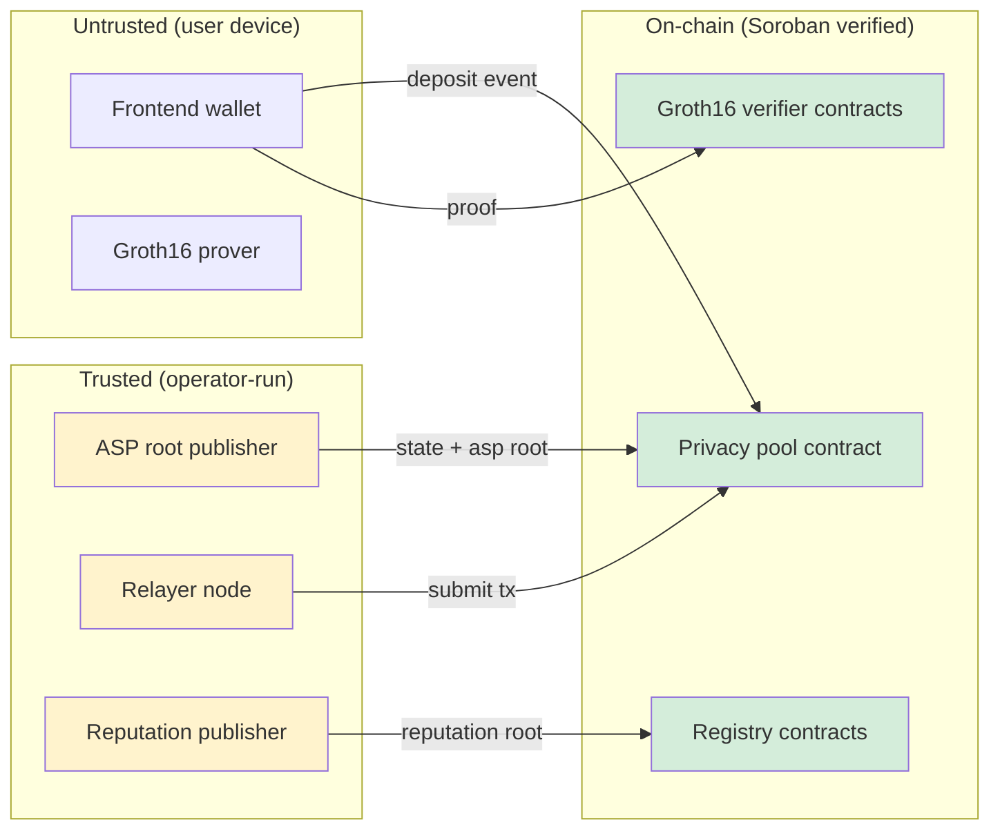
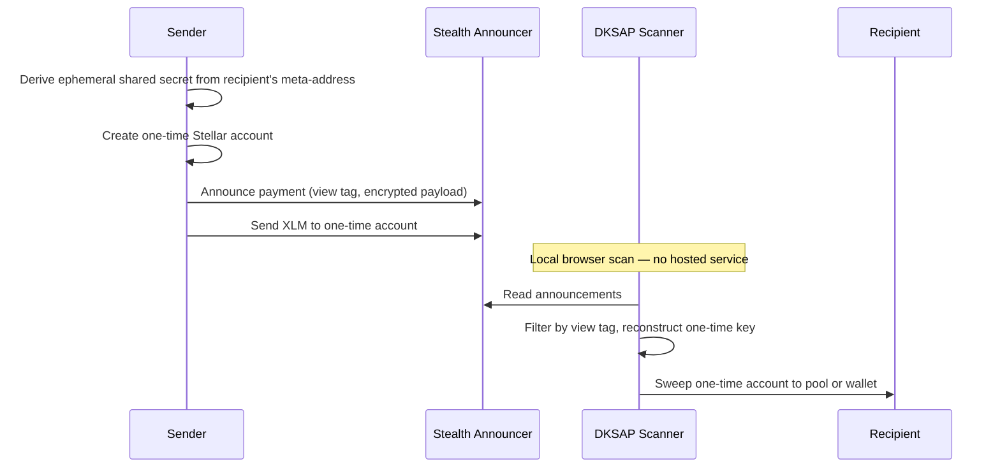
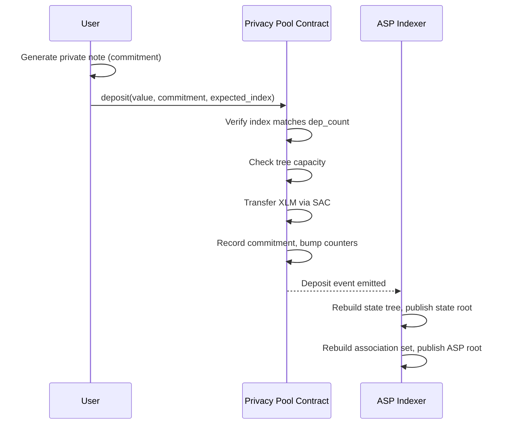
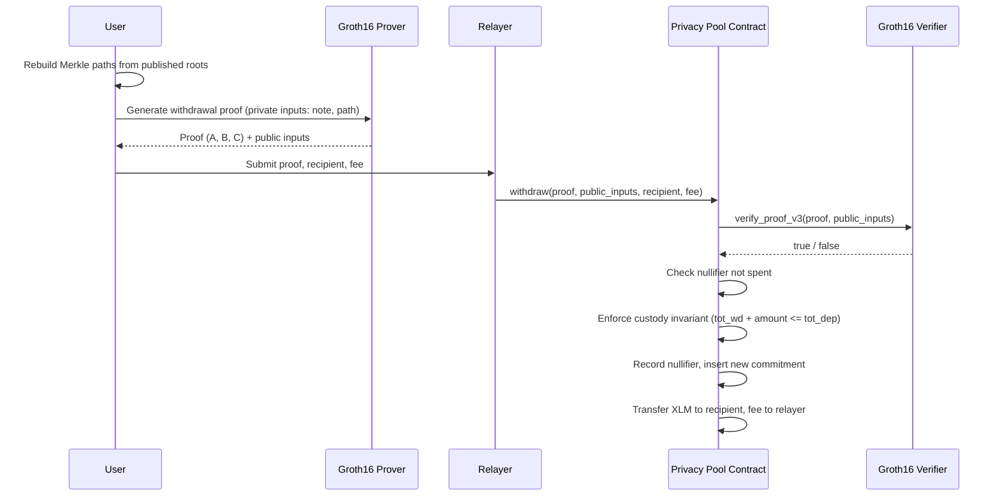
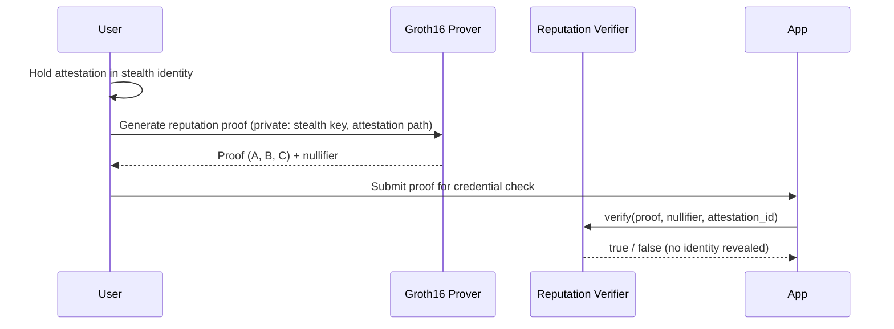

# Architecture and Protocol Flows

This document describes the on-chain and off-chain components of Opaque, their trust boundaries, and the end-to-end flows for private payments, pool deposits/withdrawals, and reputation proofs.

## Component overview

## Trust boundaries

The diagram below highlights which components are trusted, which are untrusted, and where ZK enforcement replaces trust.

**Yellow** = operator-run, trusted for liveness but not for funds. **Green** = on-chain, enforced by Soroban contracts and ZK proofs.

Key trust boundaries:
- **User → On-chain:** The user's wallet generates proofs locally; the on-chain verifier enforces correctness. No operator is in the proof path.
- **ASP → Pool:** The ASP publishes roots but cannot mint funds. A bad root is detected by clients rebuilding from chain history.
- **Relayer → Pool:** The relayer submits transactions but cannot change the recipient, amount, or fee — these are bound in the ZK proof's public context.

## Flow: Stealth payment (send / receive / scan)

## Flow: Privacy pool deposit

## Flow: Privacy pool withdrawal

## Flow: Reputation proof

## On-chain contract map

| Contract | Storage type | Purpose |
| --- | --- | --- |
| `privacy-pool` | instance + persistent | Holds deposits, verifies withdrawal proofs, enforces custody and nullifier replay protection |
| `groth16-verifier` (pool) | — | Verifies the v3 withdrawal Groth16 proof (BN254) |
| `reputation-verifier` | instance + persistent | Verifies reputation roots, nullifiers, and attestation proofs |
| `groth16-verifier` (rep) | — | Verifies the reputation Groth16 proof |
| `stealth-registry` | persistent | Stores recipient meta-addresses |
| `stealth-announcer` | persistent | Records payment announcements and view tags |
| `schema-registry` | persistent | Stores attestation schemas |
| `attestation-engine` | persistent | Issues and verifies attestations |
| `relayer-registry` | persistent | Tracks relayer operators, stake, jobs, and settlement |

## Off-chain services

| Service | Path | Purpose |
| --- | --- | --- |
| ASP indexer | `asp/` | Rebuilds state and association-set trees from chain events, publishes roots |
| Reputation publisher | `publisher/` | Collects attestation leaves, builds and publishes Merkle roots |
| Relayer hub + node | `relayer/` | HTTP gateway, encrypted payload handling, blind withdrawal submission |
| DKSAP scanner | `scanner/` | Rust WASM module for browser-side stealth payment detection |
| Frontend wallet | `frontend/` | React wallet with Freighter integration, proof generation, pool operations |
